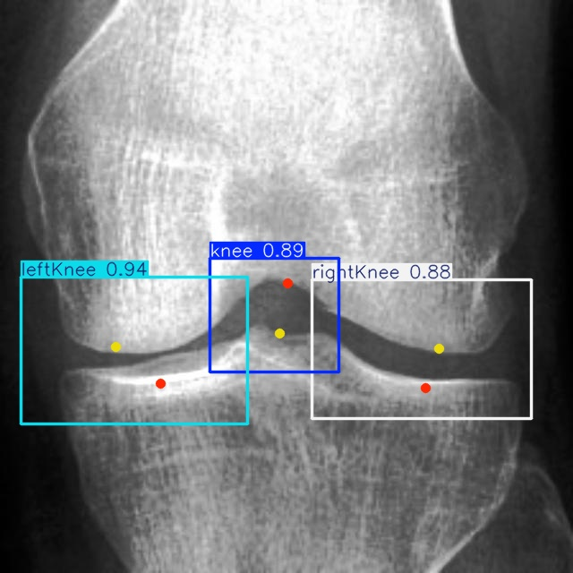
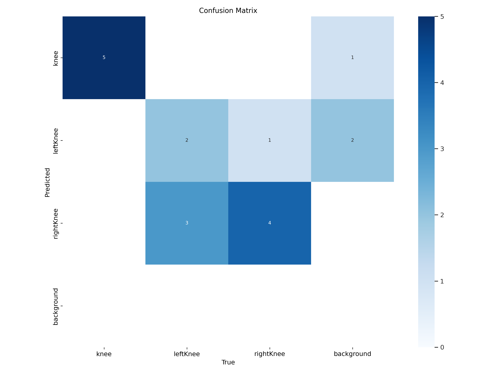
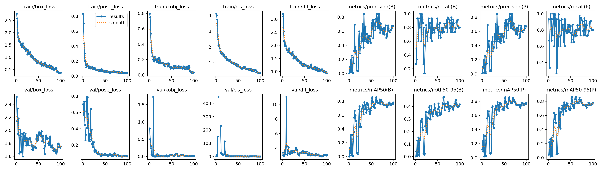

# Knee Xray keypoints detection YOLOV8

Training and validation with yolov8 with the [Knee Xray roboflow](https://universe.roboflow.com/dotdetection/pointkneedetectionv5/dataset/13) dataset (keypoint labeling) with tranfer learning with pose estimation.

-----

#### Validation Results

  

#### Confusion Matrix

  

#### Results

  

